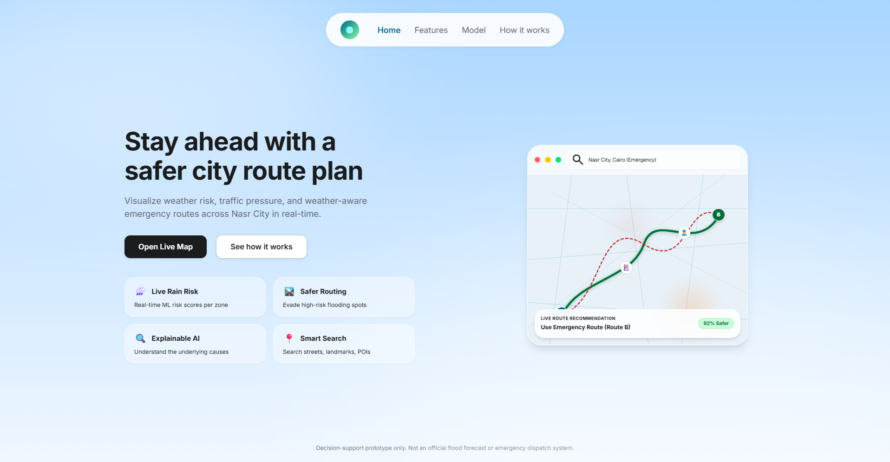
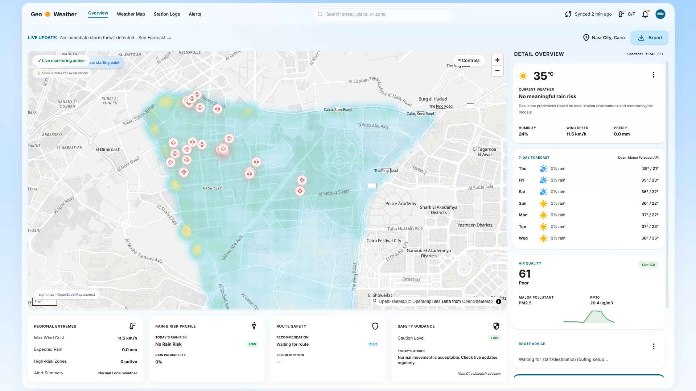
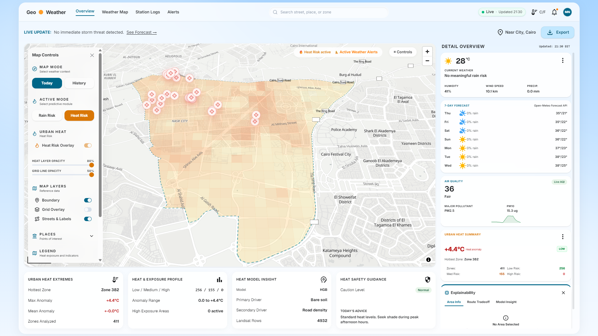

<div align="center">

# 🌦️ Geo Weather

### Nasr City Weather Impact & Urban Heat Risk Dashboard

**A live smart-city digital twin dashboard for weather-impact risk, emergency mobility, and urban heat intelligence in Nasr City, Cairo.**

[](https://mahmoudnagiubx-geoweather.hf.space/)
[](https://fastapi.tiangolo.com/)
[](https://maplibre.org/)
[](https://scikit-learn.org/)

</div>

---

### Landing Page



---

## 🚀 Live Application

Try the deployed application here:

👉 **[Geo Weather Live Demo](https://mahmoudnagiubx-geoweather.hf.space/)**

Health endpoints:

- [`/api/weather-impact/health`](https://mahmoudnagiubx-geoweather.hf.space/api/weather-impact/health)
- [`/api/weather-impact/heat/health`](https://mahmoudnagiubx-geoweather.hf.space/api/weather-impact/heat/health)

---

## 📌 Project Overview

**Geo Weather** is a full-stack geospatial AI project that demonstrates how smart-city systems can transform open urban data into practical decision-support intelligence.

The system focuses on **Nasr City, Cairo** and answers questions such as:

- Which zones may become riskier after rainfall?
- Which urban areas show stronger heat exposure?
- How can weather affect emergency mobility and route safety?
- Why does the model consider a zone or route risky?
- How can live data, geospatial analysis, routing, and explainable AI work together in one dashboard?

The project was built as a polished DP / capstone-style smart-city module and is designed to be understandable for evaluators, recruiters, and engineering reviewers.

---

## 🖼️ Screenshots

### Rain Risk & Live Weather Dashboard



### Urban Heat Risk Mode



---

## ✨ Key Features

### 1. Live Smart-City Weather Dashboard

Geo Weather presents a clean operational dashboard with:

- current weather conditions
- rainfall probability
- wind speed and humidity
- precipitation status
- 7-day forecast
- air quality information
- map-based risk visualization
- compact operational cards for quick understanding

### 2. Rain Risk Intelligence

The rain-risk module estimates relative weather-impact risk using engineered geospatial and weather features. It visualizes risk zones directly on the map so users can understand the city situation spatially instead of reading raw numbers.

### 3. Weather-Aware Routing

The project supports route intelligence designed around emergency mobility. The goal is not only to show a route, but to compare route choices under weather-impact conditions and help users understand safer movement options.

### 4. Urban Heat Risk Module

Geo Weather includes an urban heat risk mode that highlights areas with stronger heat impact using satellite-derived land-surface temperature patterns and engineered urban features.

Heat mode includes:

- hottest zone summary
- maximum anomaly
- analyzed zone count
- heat exposure profile
- heat model insight
- heat safety guidance

### 5. Explainable AI Panels

A core strength of the project is **explainability**. Users can inspect model-driven insights instead of only seeing a final score.

The dashboard includes explanation areas for:

- selected zones
- route tradeoffs
- model insight
- important risk drivers
- heat and weather-impact factors

### 6. Smart Search and Map Navigation

The project includes map search behavior to help users move quickly to streets, places, or important city features without manually panning and zooming across the map.

### 7. Live Deployment

The application is deployed publicly using Hugging Face Spaces and can be opened by reviewers from a browser without local setup.

---

## 🧠 What Makes This Project Strong

This is not just a weather dashboard. It combines multiple engineering layers into one working system:

| Layer | What It Does |
|---|---|
| Geospatial pipeline | Builds Nasr City boundaries, roads, zones, and map-ready layers |
| Weather pipeline | Uses weather data to support live and scenario-based risk estimation |
| Machine learning | Trains and exports risk models and model artifacts |
| Urban heat analysis | Uses satellite-derived heat indicators and geospatial features |
| Routing engine | Compares routes using weather-aware road risk logic |
| Explainability | Shows why zones or routes are considered risky |
| API layer | Exposes results through FastAPI endpoints |
| Frontend dashboard | Provides a polished React + MapLibre interactive interface |
| Deployment | Runs as a live application on Hugging Face Spaces |

For recruiters, this project demonstrates:

- full-stack engineering
- machine learning engineering
- geospatial data processing
- API design
- frontend product thinking
- deployment and debugging
- explainable AI awareness
- real-world smart-city problem solving

---

## 🏗️ System Architecture

```text
Open Data Sources
    ↓
Geospatial Processing Pipeline
    ↓
Weather + Heat + Road Feature Engineering
    ↓
Risk Models and Route Calculations
    ↓
FastAPI Backend
    ↓
React + TypeScript + MapLibre Dashboard
    ↓
Live Hugging Face Deployment
```

---

## 🗺️ Data Sources

Geo Weather is designed around open and accessible data sources, including:

- **OpenStreetMap / OSMnx** — road network, map context, and urban features
- **Open-Meteo** — live and forecast weather data
- **Landsat** — satellite-derived land-surface temperature indicators for heat analysis
- **GHSL Built-Up Surface** — built environment density indicators
- **ESA WorldCover** — land-cover and vegetation-related features
- **SRTM elevation data** — elevation and slope context where applicable
- **MapLibre / OpenStreetMap tiles** — browser-based map rendering

---

## 🤖 Machine Learning & Analytics

The project uses a hybrid approach:

1. **Rule-based geospatial scoring** for interpretable early-stage risk estimation.
2. **Machine learning models** for stronger tabular risk prediction and model artifacts.
3. **Explainability outputs** for human-readable model reasoning.

Implemented model and analytics work includes:

- weather-impact risk modeling
- urban heat anomaly modeling
- feature engineering reports
- model benchmark reports
- exported model artifacts
- route comparison outputs
- zone-level explanation factors

---

## 🧪 Verified Quality Checks

The project has been developed with automated verification and repeated build checks.

Latest reported verification included:

- **Backend tests:** `146 / 146` passing
- **Frontend tests:** `43 / 43` passing
- **Frontend production build:** passing
- **Live backend health endpoint:** working
- **Live heat health endpoint:** working
- **Hugging Face deployment:** running

---

## 🛠️ Tech Stack

### Backend

- Python
- FastAPI
- Pydantic
- GeoPandas
- Shapely
- OSMnx
- NetworkX
- scikit-learn
- Uvicorn

### Frontend

- React
- TypeScript
- Vite
- MapLibre GL JS
- Tailwind CSS
- Framer Motion / motion UI patterns

### Data / ML / Geospatial

- OpenStreetMap
- Open-Meteo
- Landsat-derived heat features
- GHSL built-up features
- ESA WorldCover
- GeoJSON spatial layers
- Joblib model artifacts

### Deployment

- Hugging Face Spaces
- Docker
- Git LFS for large geospatial/model files

---

## 📁 Repository Structure

```text
.
├── backend/
│   └── app/
│       ├── main.py
│       ├── config.py
│       ├── tests/
│       └── weather_impact/
│           ├── router.py
│           ├── service.py
│           ├── weather.py
│           ├── routing.py
│           ├── heat.py
│           ├── heat_model.py
│           ├── heat_service.py
│           ├── explain.py
│           ├── schemas.py
│           └── paths.py
│
├── frontend/
│   ├── src/
│   │   ├── App.tsx
│   │   ├── components/
│   │   ├── api/
│   │   └── styles/
│   └── package.json
│
├── docs/
│   ├── images/
│   └── nasr_city_weather_impact/
│
├── deliverables/
│   ├── presentation/
│   ├── source_code_zip/
│   ├── team_excel/
│   └── video_demo/
│
├── Dockerfile
├── docker-compose.yml
└── README.md
```

---

## ⚙️ Run Locally

### 1. Clone the repository

```bash
git clone https://github.com/MahmoudNagiubX/Egypt-Smart-City-Digital-Twin.git
cd Egypt-Smart-City-Digital-Twin
```

### 2. Backend setup

#### Windows PowerShell

```powershell
python -m venv .venv
.\.venv\Scripts\Activate.ps1
python -m pip install --upgrade pip
pip install -r backend\requirements.txt
```

Run the backend:

```powershell
python -m uvicorn backend.app.main:app --reload --host 127.0.0.1 --port 8000
```

Open:

```text
http://127.0.0.1:8000/docs
```

### 3. Frontend setup

Open a second terminal:

```powershell
cd frontend
npm install
Set-Content -Path ".env.local" -Value "VITE_API_BASE_URL=http://127.0.0.1:8000/api/weather-impact"
npm run dev
```

Open the local frontend URL shown by Vite, usually:

```text
http://127.0.0.1:5173/
```

---

## ✅ Test Commands

### Backend

```bash
pytest backend/app/tests
```

### Frontend

```bash
cd frontend
npm test
npm run build
```

---

## 🔌 Example API Endpoints

```http
GET /api/weather-impact/health
GET /api/weather-impact/search
GET /api/weather-impact/heat/health
GET /api/weather-impact/heat/layer/latest
GET /api/weather-impact/heat/summary
GET /api/weather-impact/heat/explain/zone/{zone_code}
GET /api/weather-impact/heat/model/summary
```

Live examples:

- [Backend health](https://mahmoudnagiubx-geoweather.hf.space/api/weather-impact/health)
- [Heat health](https://mahmoudnagiubx-geoweather.hf.space/api/weather-impact/heat/health)

---

## 🎯 Review Path

If you are reviewing this project quickly, start here:

1. Open the **Live Demo**.
2. View the landing page and dashboard layout.
3. Switch between **Rain Risk** and **Heat Risk** modes.
4. Open the map controls and inspect layers.
5. Click a zone and view explainability.
6. Check the FastAPI health endpoints.
7. Review the backend `weather_impact` package.
8. Review the React dashboard components.

This gives a clear view of the product, engineering depth, and ML/geospatial work.

---

## 🧩 Why This Matters

Cities are affected by weather in ways that are spatial, operational, and time-sensitive. A normal weather app tells you the temperature. Geo Weather goes further by connecting weather to:

- risky areas
- road movement
- emergency mobility
- urban heat exposure
- explainable model reasoning
- geospatial decision support

This makes the project relevant for:

- smart city teams
- emergency response planning
- urban analytics
- logistics and mobility systems
- geospatial AI research
- climate resilience tools

---

## 👤 Author

**Mahmoud Nagib**  
Software Engineering Student · AI / ML & Full-Stack Engineering  

- GitHub: [@MahmoudNagiubX](https://github.com/MahmoudNagiubX)
- Live Project: [Geo Weather](https://mahmoudnagiubx-geoweather.hf.space/)

---

## ⭐ Closing Note

Geo Weather demonstrates how AI, geospatial data, and full-stack engineering can be combined into a practical smart-city decision-support product.

It is a prototype, but it is built with a production-style mindset: APIs, maps, tests, deployment, model artifacts, documentation, and a clear real-world use case.
